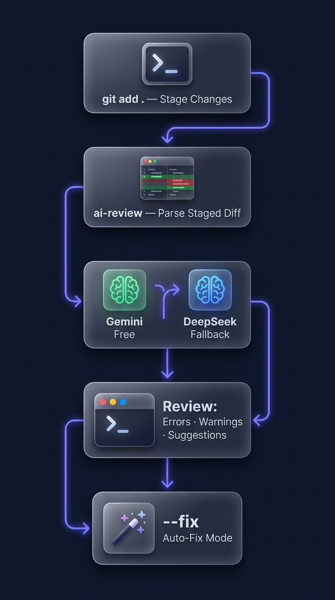

# ai-git-review

> 🤖 Free AI-powered code review on every git commit — zero config, zero cost.

[](https://www.npmjs.com/package/ai-git-review)
[](https://www.npmjs.com/package/ai-git-review)
[](https://github.com/coldxiangyu163/ai-git-review/blob/main/LICENSE)
[](https://github.com/coldxiangyu163/ai-git-review/actions/workflows/ci.yml)
[](https://nodejs.org/)

## 📦 Installation

```bash
npm install -g ai-git-review
```

Get your free Gemini API key: https://aistudio.google.com/apikey

```bash
export GEMINI_API_KEY="your-key"
ai-review
```

## Features

- 🆓 **Free** — uses Gemini free-tier API, zero cost
- 📝 **Incremental review** — only reviews staged changes, not the whole repo
- 🤖 **Multi-model support** — Gemini (default) + DeepSeek with automatic fallback
- 🔄 **Auto fallback** — if primary model fails, seamlessly switches to backup
- 🔧 **Auto-fix mode** — AI generates and applies fixes for detected issues
- ⚙️ **Configurable rules** — customize review focus via `.ai-review.json`
- 🪝 **Git hooks integration** — auto-review on `pre-commit`

## Quick Start

```bash
# 1. Install globally
npm install -g ai-git-review

# 2. Set your free Gemini API key
export GEMINI_API_KEY="your-key"   # Get it free: https://aistudio.google.com/apikey

# 3. Review your staged changes
git add .
ai-review

# 4. (Optional) Auto-fix issues
ai-review --fix
```

That's it! No config files needed. 🎉

## How It Works

<p align="center">
  
</p>

1. **Stage your changes** — `git add .`
2. **Run `ai-review`** — parses the staged diff into file-level chunks
3. **LLM analysis** — sends chunks to Gemini (free) or DeepSeek (fallback) for review
4. **Terminal output** — issues are printed with severity, line numbers, and suggestions
5. *(Optional)* **Auto-fix** — `--fix` generates patches, previews diffs, and applies fixes

## Installation

### Global install (recommended)

```bash
npm install -g ai-git-review
```

### npx (no install)

```bash
npx ai-git-review
```

### Local project install

```bash
npm install --save-dev ai-git-review
```

## Setup

Set at least one API key:

```bash
# Gemini (free, recommended)
export GEMINI_API_KEY="your-gemini-api-key"

# DeepSeek (optional, used as fallback)
export DEEPSEEK_API_KEY="your-deepseek-api-key"
```

Get your free Gemini API key at: https://aistudio.google.com/apikey

## Usage

### Review staged changes

```bash
git add .
ai-review
```

### Auto-fix mode

AI reviews your code, generates fixes, and applies them:

```bash
# Review → generate fixes → preview → confirm → apply
ai-review --fix

# Skip confirmation, apply fixes directly
ai-review --fix --yes

# Preview fixes without applying (dry-run)
ai-review --fix --dry-run
```

### Install as git hook

```bash
ai-review --init
```

This adds a `pre-commit` hook that runs AI review before each commit.

### Show current config

```bash
ai-review --config
```

### Show help

```bash
ai-review --help
```

## Output Example

### Review mode

```
$ ai-review

  ┌──────────────────────────────────────────┐
  │  ai-git-review v0.2.0                    │
  │  Reviewing 3 file(s) with gemini...      │
  └──────────────────────────────────────────┘

  src/index.js
    ✖ error:5    Potential null reference — user may be undefined
                 → Add null check before accessing property

    ⚠ warning:12 Magic number used in comparison
                 → Extract to named constant for readability

  src/utils.js
    ⚠ warning:8  Unused variable 'temp'
                 → Remove or use the declared variable

  ──────────────────────────────────────────
  2 errors  1 warning  │  3 file(s) reviewed

  ✖ Commit blocked — fix errors first
```

### Fix mode

```
$ ai-review --fix

  (review output as above...)

  🔧 Generating fixes...

  ┌─ Fix 1/2 ─────────────────────────────┐
  │ src/index.js:5                         │
  │ Add null check before accessing prop   │
  ├────────────────────────────────────────┤
  │ - const name = user.name;              │
  │ + const name = user?.name;             │
  └────────────────────────────────────────┘

  ┌─ Fix 2/2 ─────────────────────────────┐
  │ src/index.js:12                        │
  │ Extract magic number to constant       │
  ├────────────────────────────────────────┤
  │ - if (retries > 3) {                   │
  │ + const MAX_RETRIES = 3;               │
  │ + if (retries > MAX_RETRIES) {         │
  └────────────────────────────────────────┘

  Apply these fixes? (y/N) y

  ✅ 2 fix(es) applied, 0 skipped.
  📦 Backups created: 2 file(s) (.bak)
```

## Configuration

Create a `.ai-review.json` in your project root:

```json
{
  "model": "gemini",
  "language": "en",
  "rules": [
    "focus on security issues",
    "check for performance problems",
    "suggest naming improvements"
  ],
  "ignore": [
    "*.test.js",
    "*.spec.ts"
  ]
}
```

Or generate a default config interactively:

```bash
ai-review --init
```

### Model Options

| Model | Config Value | API Key Env | Notes |
|---|---|---|---|
| Google Gemini | `"gemini"` | `GEMINI_API_KEY` | Free tier: 15 RPM |
| DeepSeek | `"deepseek"` | `DEEPSEEK_API_KEY` | OpenAI-compatible API |

### Fallback Behavior

If the primary model fails (rate limit, network error, etc.), ai-git-review automatically tries the other model:

- **Primary: Gemini** → Fallback: DeepSeek
- **Primary: DeepSeek** → Fallback: Gemini

Both API keys must be set for fallback to work.

### CLI Options

| Option | Description |
|---|---|
| `--fix` | Enable auto-fix mode: review → generate fixes → apply |
| `--dry-run` | Preview fixes without applying (use with `--fix`) |
| `--yes`, `-y` | Skip confirmation prompt (use with `--fix`) |
| `--init` | Install pre-commit git hook + generate config |
| `--config` | Show current configuration |
| `--help`, `-h` | Show help message |

### Environment Variables

| Variable | Description | Default |
|---|---|---|
| `GEMINI_API_KEY` | Google Gemini API key | — |
| `DEEPSEEK_API_KEY` | DeepSeek API key (optional fallback) | — |
| `AI_REVIEW_MODEL` | Model to use | `gemini` |

## Requirements

- Node.js >= 18.0.0
- Git

## Contributing

1. Fork the repo
2. Create your feature branch (`git checkout -b feat/amazing-feature`)
3. Commit your changes (`git commit -m 'feat: add amazing feature'`)
4. Push to the branch (`git push origin feat/amazing-feature`)
5. Open a Pull Request

## License

[MIT](LICENSE) © coldxiangyu
